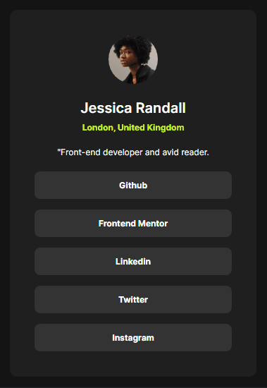

# Desafio Social Links Profile - Frontend Mentor

Meu terceiro desafio do Frontend Mentor, sendo ele o Social Links Profile um card contendo algumas informações e links de mídias    sociais.😁

## Índice
- [Desafio Social Links Profile - Frontend Mentor](#desafio-social-links-profile---frontend-mentor)
  - [Índice](#índice)
  - [Visão Geral](#visão-geral)
    - [Screenshots](#screenshots)
      - [Design](#design)
      - [Site](#site)
    - [Link](#link)
  - [Meu Processo](#meu-processo)
    - [Tecnologias/Programas Utilizados 💻](#tecnologiasprogramas-utilizados-)
  - [Conclusão](#conclusão)

## Visão Geral 

Meu objetivo nesse desafio, se consistia em fazer um simples card contendo algumas informações como avatar, nome, localidade, uma descrição e links para as mídias sociais.

### Screenshots

#### Design

Desktop Design

Mobile Design

#### Site

### Link

- Site do Card Social: [Card Social](https://msumii.github.io/desafio-social-links-profile-frontend-mentor/)
- Site da Solução: [Solução](https://www.frontendmentor.io/solutions/social-links-profile-com-flexbox-TA6UmEEf3B)

## Meu Processo
Assim como todos os outros desafios feitos no Frontend Mentor, esse também foi bem tranquilo agora que peguei o jeito com o Flexbox, apenas usando o display pra deixar tudo mais centralizado foi muito bom, além do mais também aprendi a mudar a cor do elemento quando você o ativa e foi bem divertido aprender coisas novas 😀

### Tecnologias/Programas Utilizados 💻

- HTML
- CSS
- Git
- VSCode

## Conclusão

Para concluir, fiz tudo também sem ver nenhum tipo de apoio, apenas fui no olho e com o conhecimento que eu tinha e foi tudo se encaminhando super rápido, agora me sinto preparado para por desafios com JS em prática também 😉